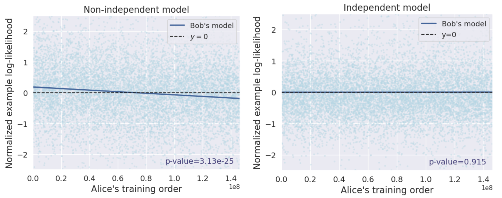

# Blackbox Model Provenance via Palimpsestic Membership Inference

Suppose Alice trains an open-weight language model, and subsequently Bob uses a blackbox derivative of
Alice’s model to produce text. Can Alice prove that
Bob is using her model, either by querying Bob’s derivative model (_query_ setting) or from the text alone (_observational_ setting)?

We propose tests using the **training order** of Alice's model and investigate it through the
lens of _palimpsestic memorization_ in language models: models are more likely
to memorize data seen later in training, so we can test whether Bob is using
Alice’s model using test statistics that capture correlation between the likelihood
of tokens in Bob’s text. 



Specifically, this repository provides code for independence testing: 
- In the _query_ setting, compute p-values for the independence test given a model and a transcript (i.e., ordered training data samples)
- In the _observational_ setting, compute p-values for the independence test given some sampled text and a transcript
  - with a partitioning method
  - and reshuffling method

## Requirements

Install the necessary packages using:

```bash
uv sync
```

## Usage 

We provide scripts for models we experiment on, Pythia and OLMo families, and for both settings. 

#### `scripts/query/run_query_test.py` 
This script runs the query setting test w/ a reference model (see Equation 2) using the first `n` samples from a given transcript.
This script accepts these command-line arguments:
- `--model`: HuggingFace model ID for the model to be audited.
- `--ref_model`: HuggingFace model ID for the reference model.
- `--n_samples`: Number of samples from the trascript to use for the statistic.
- `--transcript`: Name or path to a HuggingFace dataset that contains ordered training data samples. The dataset should contain an `index` column and a `tokens` column.
- `--metric_column_name`: If specified, uses the precomputed metrics stored at the given column (e.g. losses for the model to be audited).
- `--ref_model`: If specified, uses the precomputed metrics stored at the given column (e.g. losses for the reference model).

**Example:** Recompute metrics with
```bash
python scripts/query/run_query_test.py \
    --model EleutherAI/pythia-6.9b-deduped \
    --ref_model EleutherAI/pythia-6.9b \
    --n_samples 100000 \
    --transcript hij/sequence_samples/pythia_deduped_100k
```
or use pre-computed metrics with
```bash
python scripts/query/run_query_test.py \
    --n_samples 100000 \
    --transcript hij/sequence_samples/pythia_deduped_100k
    --metric_column_name loss_pythia-6.9b-deduped_main
    --ref_metric_column_name loss_pythia-6.9b_main
```
We provide partial transcripts and precomputed losses for some Pythia and OLMo datasets and derivative models here: https://huggingface.co/datasets/hij/sequence_samples. 

#### `scripts/observation/partition.py` 
This script runs the observational setting test that partitions a model's training transcript based on data order. We provide a general script that accepts the path to 
an InfiniGram index (see https://infini-gram.readthedocs.io/en/latest/) and a list of texts (saved w/ pickle). 
This script accepts these command-line arguments: 
- `--texts_paths`: Path to the text samples to be audited. 
- `--infinigram_index_dir`: Path to local InfiniGram index. 
- `--n_texts`: Number of texts to use for the statistic.
- `--k`: Max. tokens for matching k-grams.
- `--tokenizer_name`: Tokenizer to tokenize the texts and used to build the index.

**Example:**
```bash
python partition.py --texts_paths gens.pkl --infinigram_index_dir /path/to/index --n_texts 100000
```

## Data

We release the transcripts used in our experiment on [HuggingFace](https://huggingface.co/datasets/hij/sequence_samples). We also provide the pre-computed sequence logprobs.
